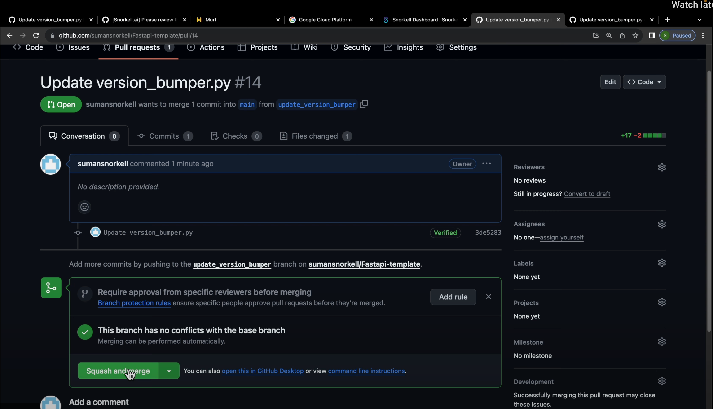
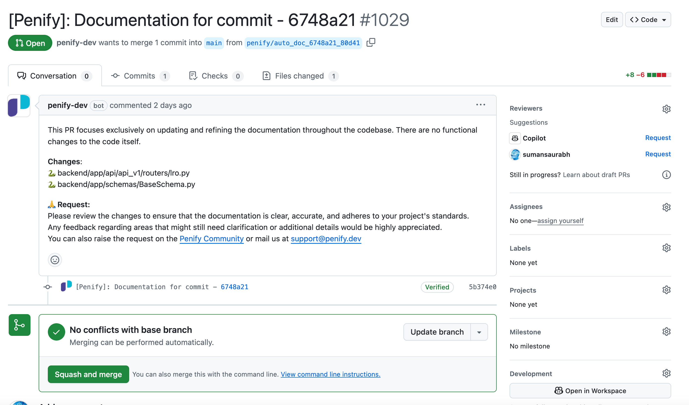
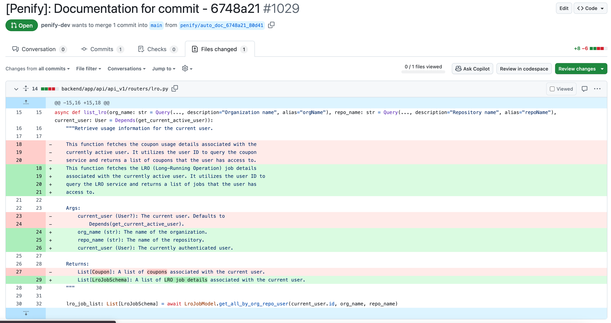

# Commit Documentation with Penify

Keeping your project's documentation accurate and up-to-date is essential for effective collaboration and maintainability. Penify simplifies this process by automatically generating documentation whenever commits are merged into your GitHub repository.

## How Commit Documentation Works

Once you've [installed Penify](./what-is-penify.md) on your GitHub repository or organization, Penify automatically integrates with GitHub webhooks. This integration allows Penify to monitor your repository continuously, detecting whenever new commits are merged into your main or designated branches.

Upon detecting a merged commit, Penify immediately analyzes the changes introduced. It intelligently identifies new or updated classes, functions, APIs, and architectural components within your codebase. Using advanced code analysis techniques, Penify generates detailed, accurate documentation reflecting these changes.

Penify then automatically creates a new pull request (PR) containing the generated documentation updates. This PR clearly outlines the documentation changes, making it easy for your team to review and merge.

## Reviewing and Merging Documentation PRs

The PR created by Penify includes:

- A clear summary of documentation updates.
- Detailed descriptions of the code changes documented.
- References to the original commits for easy context.

Reviewers can quickly verify the accuracy and completeness of the documentation directly within the PR. If necessary, reviewers can suggest edits or request additional changes before merging.

Once satisfied, simply merge the PR to integrate the updated documentation into your project's main documentation branch.

## Example Workflow

Here's a typical workflow demonstrating Penify's Commit Documentation feature:

1. **Commit Merged**: A developer merges a commit into the main branch.
   
   

2. **Penify Detects Changes**: Penify automatically detects the merged commit via GitHub webhook integration.

3. **Documentation PR Created**: Penify generates documentation and creates a new PR with detailed updates.

   

4. **Review and Merge**: Team members review the PR, suggest edits if needed, and merge the documentation updates.

   

## Benefits of Automated Commit Documentation

Automating commit documentation with Penify provides several key benefits:

- **Continuous Accuracy**: Documentation remains consistently aligned with your latest codebase changes.
- **Time Savings**: Eliminates manual documentation updates, allowing developers to focus on core tasks.
- **Enhanced Collaboration**: Clear, up-to-date documentation improves team communication and onboarding.
- **Reduced Errors**: Automation minimizes human error, ensuring reliable and accurate documentation.

## Getting Started

To start benefiting from automated commit documentation, follow our [installation guide](./what-is-penify.md) to integrate Penify with your GitHub repository or organization. Once installed, Penify will automatically handle documentation updates, keeping your project's documentation accurate and current at all times.

