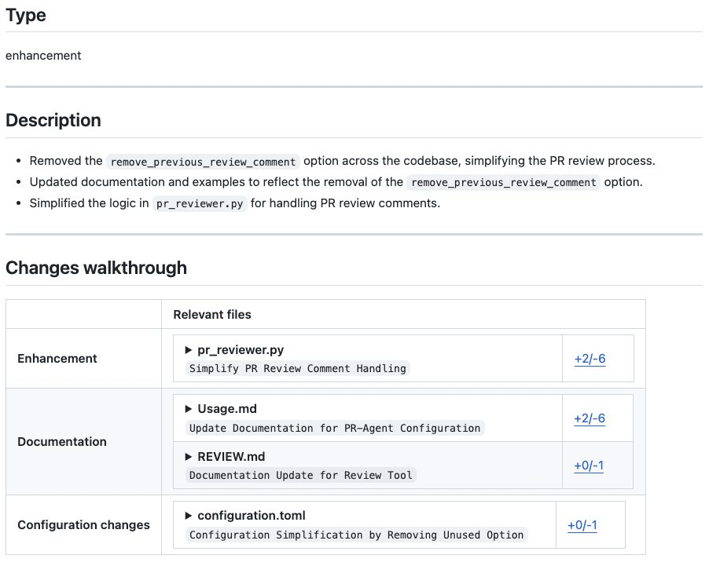
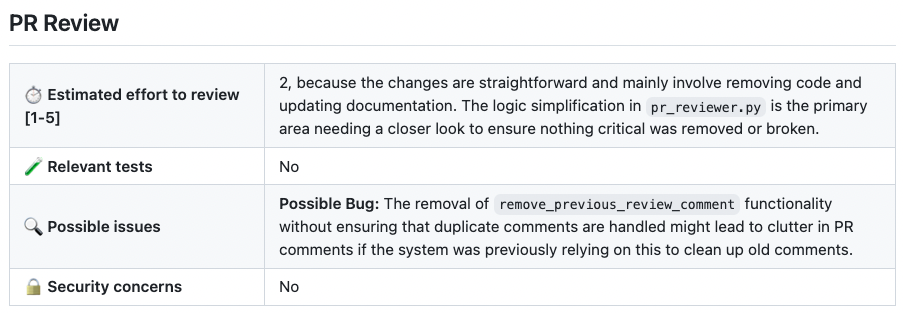
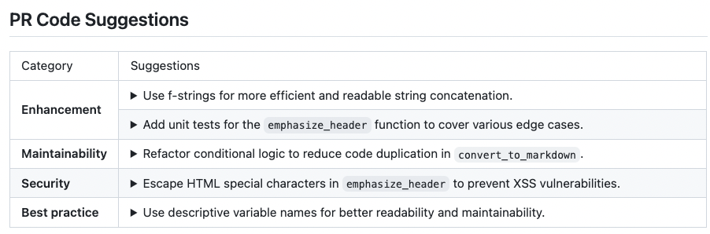
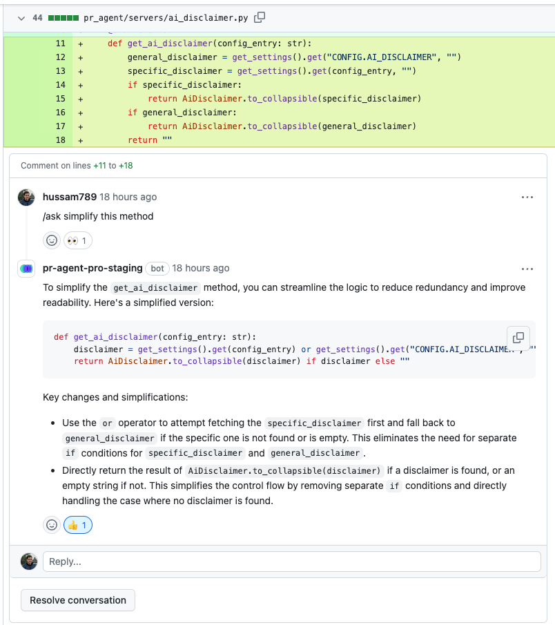
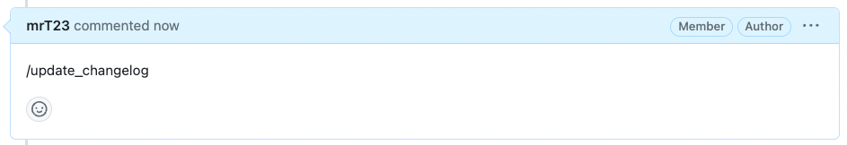
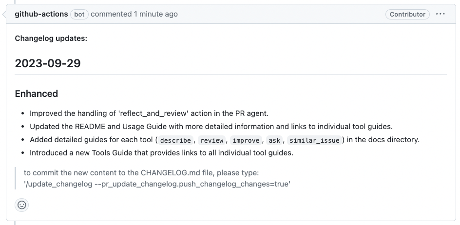

# Instant Pull Request Insight

Penify's Pull Request Insight is a comprehensive solution that transforms the way development teams review, understand, and enhance their pull requests. Powered by advanced LLM, our solution offers real-time analysis, intelligent feedback, and automated improvements to streamline the PR workflow. The fundamental code for this analysis has been copied from - [PR Agent](https://github.com/qodo-ai/pr-agent). I just do not like the way they have implemented and hence forked and made my own changes.

## Overview

Penify Pull Request Insight supports a wide range of platforms and provides an extensive suite of features designed to enhance code quality and developer productivity:

|       | Feature | GitHub | GitLab | Bitbucket | Azure DevOps |
|-------|---------|:------:|:------:|:---------:|:------------:|
| CORE  | Review | ✅ | ✅ | ✅ | ✅ |
|       | Describe | ✅ | ✅ | ✅ | ✅ |
|       | Improve | ✅ | ✅ | ✅ | ✅ |
|       | Ask | ✅ | ✅ | ✅ | ✅ |
|       | Ask on code lines | ✅ | ✅ | | |
|       | Update CHANGELOG | ✅ | ✅ | ✅ | ✅ |
|       | Help Docs | ✅ | ✅ | ✅ | |
|       | Ticket Context | ✅ | ✅ | ✅ | |
|       | Best Practices Analysis | ✅ | ✅ | ✅ | |
|       | PR Chat | ✅ | | | |
|       | Suggestion Tracking | ✅ | ✅ | | |
|       | CI Feedback | ✅ | | | |
|       | PR Documentation | ✅ | ✅ | | |
|       | Custom Labels | ✅ | ✅ | | |
|       | Code Analysis | ✅ | ✅ | | |
|       | Similar Code Detection | ✅ | | | |
|       | Custom Prompt | ✅ | ✅ | ✅ | |
|       | Test Generation | ✅ | ✅ | | |
|       | Code Implementation | ✅ | ✅ | ✅ | |
|       | Auto-Approve | ✅ | ✅ | ✅ | |

## Key Features

### Auto Description (`/describe`)




The Auto Description feature automatically generates comprehensive pull request descriptions, saving developers time and ensuring consistency across projects.

**Capabilities:**
- Generates concise yet informative PR titles
- Identifies the PR type (feature, bugfix, refactor, etc.)
- Provides a summary of changes and their purpose
- Creates a detailed code walkthrough highlighting key modifications
- Suggests appropriate labels based on the code changes

**Benefits:**
- Ensures consistent PR documentation across teams
- Reduces time spent writing descriptions
- Improves understanding for reviewers
- Creates a valuable historical record for future reference
- Helps new team members understand code evolution

**Usage:**
```
@PenifyBot /describe
```

### Auto Review (`/review`)



The Auto Review feature performs an in-depth analysis of pull requests to identify potential issues, suggest improvements, and assess overall quality.

**Capabilities:**
- Conducts comprehensive code reviews focusing on:
  - Code quality and best practices
  - Security vulnerabilities
  - Performance implications
  - Maintainability concerns
  - Testing adequacy
- Provides an estimated review effort score
- Highlights critical issues requiring human attention
- Suggests code structure improvements

**Benefits:**
- Catches issues before they reach production
- Reduces burden on human reviewers
- Ensures consistent review standards
- Accelerates review cycles
- Helps junior developers learn better practices

**Usage:**
```
@PenifyBot /review
```

### Code Suggestions (`/improve`)




The Code Suggestions feature analyzes the pull request and offers specific, contextual improvements to enhance code quality.

**Capabilities:**
- Provides actionable code suggestions with explanations
- Improves code readability and maintainability
- Optimizes performance through better patterns
- Highlights opportunities for reducing complexity
- Suggests modern language features when applicable

**Benefits:**
- Delivers continuous learning to developers
- Elevates code quality across the project
- Standardizes code style throughout the codebase
- Reduces technical debt buildup
- Makes code more maintainable for future developers

**Usage:**
```
@PenifyBot /improve
```

### Question Answering (`/ask`)




The Question Answering feature allows developers to ask free-text questions about a pull request and receive contextually-aware answers.

**Capabilities:**
- Answers specific questions about code changes
- Explains reasoning behind implementation decisions
- Clarifies how new code interacts with existing systems
- Provides context for changes in relation to requirements
- Offers insights on potential implications

**Benefits:**
- Reduces back-and-forth in PR discussions
- Accelerates the review process
- Helps new team members understand code faster
- Preserves knowledge about implementation decisions
- Supports remote and asynchronous work environments

**Usage:**
```
@PenifyBot /ask Why was this particular approach chosen for handling authentication?
```

### Update Changelog (`/update_changelog`)




The Update Changelog feature automatically identifies changes in the pull request and updates the CHANGELOG.md file accordingly.

**Capabilities:**
- Recognizes significant changes worthy of changelog entries
- Categorizes changes (Added, Changed, Fixed, etc.)
- Creates properly formatted changelog entries
- Maintains version numbering consistency
- Preserves existing changelog structure

**Benefits:**
- Ensures changelog is always up to date
- Provides consistent formatting across entries
- Reduces manual documentation burden
- Creates a reliable historical record of changes
- Improves communication with users and stakeholders

**Usage:**
```
@PenifyBot /update_changelog
```

### Help Docs (`/help_docs`)

The Help Docs feature allows querying repository documentation to answer specific questions about the codebase.

**Capabilities:**
- Searches through project documentation
- Provides contextual answers based on documentation content
- References specific documentation sections in responses
- Works with various documentation formats

**Benefits:**
- Eliminates time spent searching for information
- Keeps documentation knowledge accessible
- Reduces interruptions to other team members
- Encourages documentation usage
- Supports knowledge sharing across the team

**Usage:**
```
@PenifyBot /help_docs How do I set up the development environment?
```

### Add Documentation (`/add_docs`)

The Add Documentation feature automatically generates documentation for methods, functions, and classes that have changed in the pull request.

**Capabilities:**
- Creates function and method documentation in the proper format
- Documents parameters, return values, and exceptions
- Explains function purpose and usage
- Maintains consistent documentation style
- Updates existing documentation when functions change

**Benefits:**
- Ensures code is always well-documented
- Maintains documentation quality standards
- Reduces developer documentation overhead
- Improves codebase maintainability
- Helps new developers understand functionality

**Usage:**
```
@PenifyBot /add_docs
```

### Generate Custom Labels (`/generate_labels`)

The Generate Custom Labels feature creates appropriate labels for pull requests based on user-defined guidelines and code content.

**Capabilities:**
- Generates labels based on custom organizational criteria
- Identifies technical areas affected by changes
- Tags cross-cutting concerns (performance, security, etc.)
- Recognizes development lifecycle stages
- Helps with release planning through appropriate labeling

**Benefits:**
- Improves PR organization and searchability
- Enhances project management visibility
- Facilitates reporting and metrics
- Standardizes labeling practices
- Supports release planning and management

**Usage:**
```
@PenifyBot /generate_labels
```

### Analyze (`/analyze`)

The Analyze feature provides a detailed breakdown of code components changed in the pull request and enables interactive generation of tests, documentation, and improvements.

**Capabilities:**
- Identifies all modified components
- Analyzes changes at a structural level
- Assesses impact on the broader codebase
- Enables selective test and documentation generation
- Provides component-specific improvement suggestions

**Benefits:**
- Delivers a comprehensive view of PR impact
- Supports targeted quality improvements
- Facilitates thorough but efficient reviews
- Improves understanding of cross-component effects
- Helps prioritize review efforts

**Usage:**
```
@PenifyBot /analyze
```

### Test Generation (`/test`)

The Test Generation feature creates unit tests for selected components based on the code changes in the pull request.

**Capabilities:**
- Generates unit tests with appropriate assertions
- Creates test cases covering different scenarios
- Sets up necessary test fixtures and mocks
- Ensures adequate code coverage
- Follows project testing patterns and styles

**Benefits:**
- Increases test coverage consistently
- Reduces testing overhead for developers
- Ensures all code paths are tested
- Catches edge cases that might be missed
- Maintains consistent testing practices

**Usage:**
```
@PenifyBot /test component_name
```

### Custom Prompt (`/custom_prompt`)

The Custom Prompt feature allows users to define specific guidelines for analyzing and improving pull requests based on organizational standards.

**Capabilities:**
- Accepts custom prompt templates
- Applies organization-specific standards
- Supports complex, multi-criteria evaluation
- Enables specialized guidance for different projects
- Allows for evolving standards over time

**Benefits:**
- Ensures organization-specific standards are applied
- Provides consistent feedback across teams
- Supports unique project requirements
- Enables customized code quality approaches
- Adapts to evolving best practices

**Usage:**
```
@PenifyBot /custom_prompt
```

### CI Feedback (`/checks`)

The CI Feedback feature automatically analyzes failed CI jobs and provides insights and solutions.

**Capabilities:**
- Parses CI failure logs
- Identifies root causes of build failures
- Suggests specific fixes for CI issues
- Explains complex error messages
- Provides context-aware troubleshooting steps

**Benefits:**
- Reduces time spent debugging CI failures
- Accelerates the path to successful builds
- Educates developers about CI requirements
- Minimizes disruptions to development flow
- Improves team productivity

**Usage:**
```
@PenifyBot /checks ci_job_name
```

### Similar Code (`/find_similar_component`)

The Similar Code feature identifies similar components within your organization's codebase or in open-source projects, helping maintain consistency and leverage existing patterns.

**Capabilities:**
- Finds similar code patterns in the repository
- Identifies relevant open-source implementations
- Compares structural similarities
- Suggests standardization opportunities
- Highlights code reuse possibilities

**Benefits:**
- Promotes code reuse and consistency
- Reduces duplicate implementation efforts
- Helps align with existing patterns
- Leverages proven solutions
- Improves architectural consistency

**Usage:**
```
@PenifyBot /find_similar_component
```

### Implement (`/implement`)

The Implement feature generates implementation code based on review suggestions, accelerating the iterative improvement process.

**Capabilities:**
- Creates implementation code from review feedback
- Follows project coding patterns
- Implements best practices automatically
- Generates complete, ready-to-use code
- Explains implementation decisions

**Benefits:**
- Accelerates code improvement cycles
- Reduces time between review and implementation
- Ensures consistent implementation of suggestions
- Helps developers learn better implementation patterns
- Increases overall development velocity

**Usage:**
```
@PenifyBot /implement
```

## How It Works

Penify's Pull Request Insight employs a sophisticated processing pipeline to deliver accurate, relevant, and helpful analysis of your code:

1. **PR Content Extraction**: When triggered, the system extracts the pull request content, including code changes, commit messages, and existing comments.

2. **Compression Strategy**: For large PRs, our advanced compression algorithm intelligently summarizes the changes while preserving critical context, ensuring effective analysis regardless of PR size.

3. **Contextual Analysis**: The system analyzes not just the changed code, but also surrounding context, repository structure, and project patterns to provide holistic insights.

4. **LLM Processing**: Our advanced language models process the prepared context and generate appropriate responses based on the requested command.

5. **Response Generation**: Results are formatted for optimal readability and actionability, focusing on practical, implementable feedback.

6. **Response Delivery**: The analysis is delivered through the appropriate channel (GitHub comments, GitLab notes, etc.) with proper formatting and structure.


## Core Technical Capabilities

### PR Compression Strategy

Penify employs a sophisticated compression strategy to handle PRs of any size effectively:

- **Intelligent Chunking**: Breaks down large PRs into semantically meaningful chunks
- **Relevance Ranking**: Prioritizes the most significant code changes for analysis
- **Context Preservation**: Ensures critical contextual information is maintained despite compression
- **Adaptive Processing**: Adjusts compression levels based on PR complexity and content
- **Token-Aware Fitting**: Optimizes token usage to maximize information density

### Static Code Analysis Integration

Penify combines traditional static analysis techniques with LLM to provide comprehensive insights:

- **Syntax and Semantic Analysis**: Identifies code issues at structural and logical levels
- **Pattern Recognition**: Detects common anti-patterns and potential bugs
- **Security Analysis**: Identifies potential vulnerabilities and security risks
- **Complexity Metrics**: Evaluates code complexity and maintainability
- **Style Enforcement**: Checks adherence to coding standards and conventions

### Metadata Utilization

Penify leverages both local and global metadata to enhance PR analysis:

- **Project-Specific Knowledge**: Incorporates understanding of your project's unique patterns
- **Historical Context**: Considers past PR patterns and feedback
- **Developer Habits**: Recognizes individual developer patterns and preferences
- **Language-Specific Insights**: Applies best practices specific to each programming language
- **Framework Awareness**: Understands framework-specific patterns and requirements

### Dynamic Context Building

The system builds a comprehensive context for each analysis request:

- **File Relationship Mapping**: Understands how changed files relate to each other
- **Architecture Awareness**: Considers the broader architectural impact of changes
- **Dependency Analysis**: Identifies how changes affect dependencies
- **Cross-Reference Resolution**: Links related code sections across the PR
- **Intent Inference**: Attempts to understand the developer's intentions

### Self-Reflection Capabilities

Penify's LLM implements self-reflection to improve result quality:

- **Output Validation**: Verifies its own outputs for accuracy and helpfulness
- **Confidence Scoring**: Indicates confidence levels for different suggestions
- **Alternative Consideration**: Evaluates multiple approaches before providing recommendations
- **Assumption Awareness**: Explicitly states assumptions made during analysis
- **Limitation Recognition**: Acknowledges areas where human judgment is preferable

## Usage Options

### Command Line Interface

```bash
penifycli pr insight --pr-number 123 --command review
```

### GitHub App / Webhook

Once installed, simply mention `@PenifyBot` followed by the desired command in any PR comment:

```
@PenifyBot /review
```

## Data Privacy and Security

We prioritize the security and privacy of your code:

- **No Data Retention**: Penify does not store your code or use it for training models
- **Secure Processing**: All data is processed in isolated, ephemeral environments
- **Encryption**: All data in transit is encrypted using industry-standard protocols
- **Access Controls**: Strict access controls ensure only authorized users can access insights
- **Compliance**: Our systems comply with major security and privacy standards

## Benefits for Teams

### For Developers
- Receive instant, actionable feedback on your code
- Learn best practices through contextual suggestions
- Reduce time spent writing documentation and tests
- Get answers to specific code questions without interrupting teammates
- Submit higher quality PRs that require fewer revision cycles

### For Reviewers
- Focus on high-level design and architectural considerations
- Reduce time spent on style and basic issues already caught by Penify
- Gain deeper insights into complex changes
- Ensure comprehensive test coverage and documentation
- Maintain consistent review standards across the team

### For Engineering Managers
- Accelerate PR review cycles and reduce bottlenecks
- Improve code quality and consistency across teams
- Enhance knowledge sharing and cross-team collaboration
- Reduce onboarding time for new team members
- Generate metrics and insights on development practices

## Getting Started

To start using Penify Pull Request Insight, follow these simple steps:

1. Install the Penify App for your chosen platform (GitHub, GitLab, Bitbucket, or Azure DevOps)
2. Configure integration settings through our web dashboard
3. Start a new pull request or open an existing one
4. Invoke Penify with the appropriate command (e.g., `@PenifyBot /review`)
5. Receive insights and take action based on the recommendations

For detailed installation and configuration instructions, see our [Quick Start Guide](/docs/what-is-penify.md).

## Conclusion

Penify Pull Request Insight transforms the pull request workflow by providing LLM-powered analysis, feedback, and improvements. By automating routine aspects of code review while providing deep, contextual insights, our solution helps development teams deliver higher quality code faster while reducing the burden on human reviewers.

Experience the future of code review today with Penify Pull Request Insight.