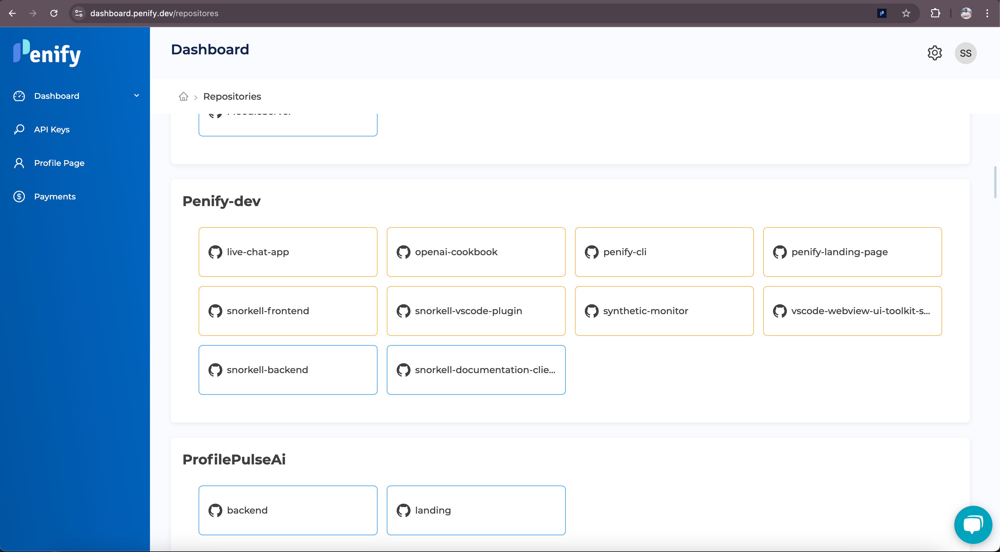
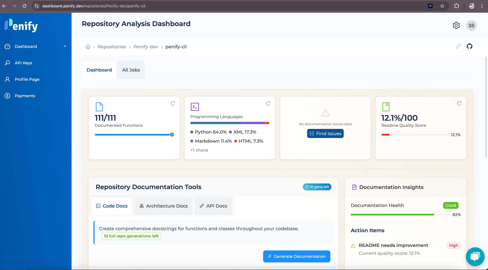
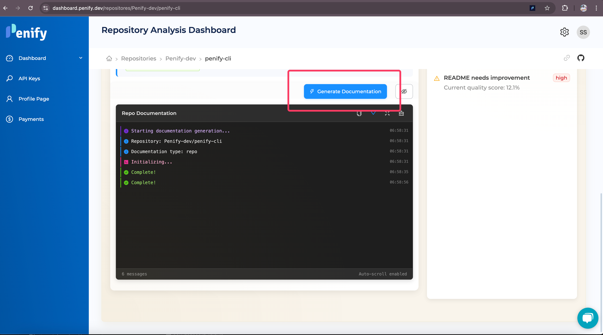
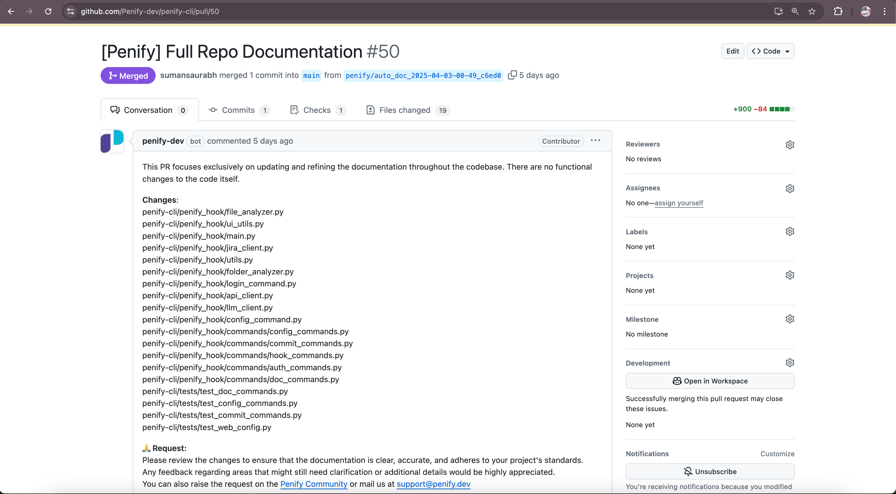
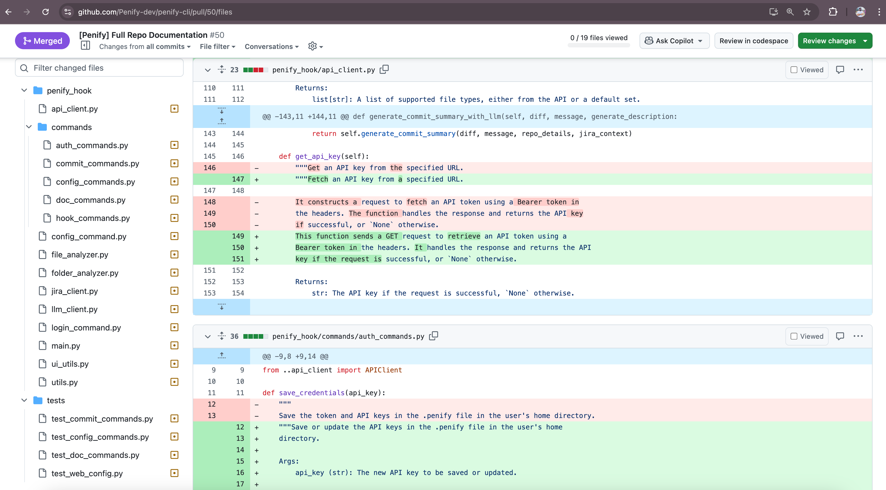

# Repo Documentation with Penify

Penify's Repo Documentation feature enables you to automatically generate comprehensive documentation for your entire GitHub repository directly from the Penify dashboard. This feature simplifies the process of documenting your project's complete codebase, APIs, architecture, and more, ensuring your documentation remains accurate and up-to-date.

## How Repo Documentation Works

Penify analyzes your entire repository, intelligently identifying and documenting:

- Classes and functions
- APIs and endpoints
- Architectural components
- Code structure and dependencies

The generated documentation provides a clear, structured overview of your entire project, making it easy for developers and stakeholders to understand and navigate your codebase.

## Generating Repo Documentation in Penify Dashboard

Follow these simple steps to generate documentation for your entire repository using the Penify dashboard:

### Step 1: Log in to Penify Dashboard

- Navigate to [Penify Dashboard](https://dashboard.penify.dev/) and log in with your GitHub account.

### Step 2: Select Your Repository

- From your dashboard, select the repository for which you want to generate documentation.

### Step 3: Configure Documentation Settings (Optional)

- Penify provides default settings optimized for most repositories. However, you can customize the documentation generation process by adjusting settings such as:
  - Documentation depth and detail level
  - Inclusion or exclusion of specific directories or files
  - Documentation output format and style
  - All this can be done using [penify.config.json](./penify-config-json.md)

### Step 4: Generate Documentation

- After configuring your settings, click "Generate Documentation" to start the documentation generation process.
- Penify will analyze your repository and automatically create comprehensive documentation.

### Step 5: Review and Merge Documentation

- Once the documentation generation is complete, Penify will notify you.
- Review the generated documentation directly within the Penify dashboard.
- After reviewing, you can publish the documentation to your repository or export it in your preferred format.
- [Sample example](https://github.com/Penify-dev/penify-cli/pull/50/files)

## Benefits of Automated Repo Documentation

Automating your repository documentation with Penify provides significant advantages:

- **Comprehensive Coverage**: Ensures your entire repository is documented thoroughly.
- **Time Efficiency**: Eliminates manual documentation efforts, allowing your team to focus on development.
- **Improved Collaboration**: Clear, structured documentation enhances team communication and onboarding.
- **Consistent Accuracy**: Automated updates ensure your documentation always reflects the latest state of your repository.

## Getting Started

To leverage Penify's Repo Documentation feature, ensure Penify is installed on your GitHub repository or organization. Follow our [installation guide](./what-is-penify.md) to get started. Once installed, you can easily generate and maintain comprehensive documentation for your entire repository directly from the Penify dashboard.
